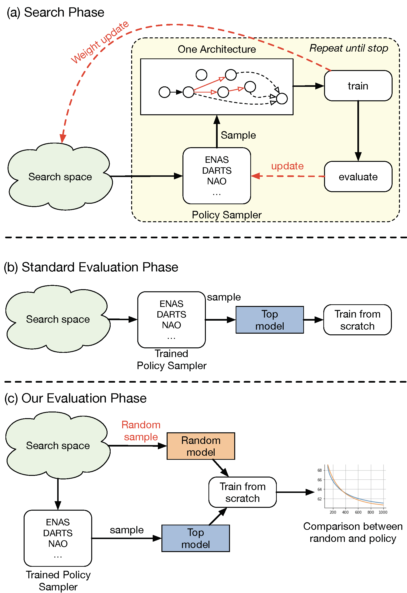

# Evaluating the search phase of neural architecture search - CNN 


### Overview

The code base captures the framework we propose to test the autoML algorithms with a single run. 
Currently we only tested on RNN search due to the limited resources and time, 
but ideally the code should work for both CNN and RNN.


As depicted in the figure, our framework first let each algorithm run in their original settings, in (a). 
Then, differs from the previous approach, only demonstrate the performance on downstream task (b), we 
explicitly sample a random architecture and compare to it in the same condition. All previous steps are repeated for at 
least 10 times for different random seeds.

## CNN Search space experiments.
Please goes to folder `cnn`.

### Requirements

- In the docker directory, you could find one docker image based containing pytorch-1.2.0 with NVIDIA cuda 10.1.
Once you build your docker image, be sure to mount your local directory with this repository into the persistent_volume
directory inside the docker image. Example: 
```
nvidia-docker run -ti -v /local/path/to/dir/:/desired_folder_in_image/ <image name>
```

The code also depends on [GitHub: NASbench-101](https://github.com/google-research/nasbench), please 
follow the instruction to install if you do not want to use the given docker image.


- Automation scripts \
We also provide the scripts to automate the process. To run the search / train from scratch only once, you could use the command as 
```bash
# for DARTS search
bash scripts/reproduce-darts.sh search debug

# for ENAS search
bash scripts/reproduce-enas.sh search debug

# for DARTS train from scratch
bash scripts/reproduce-darts.sh train_from_scratch debug

# for ENAS train from scratch
bash scripts/reproduce-enas.sh train_from_scratch debug

# for NAO train from scratch
bash scripts/reproduce-nao.sh train_from_scratch debug
```

However, to fully run our experiments, our code requires a computational platform like SLURM.
Configure your setting in `slurm-submit.sh` file and remove the `debug` option from the above example, 10 runs of the
experiment can be deployed automatically. 

### Tests on the DARTS CNN search space 

- Cost
    - It should take around 1.5 * 10 * 3 ~ 45 GPU days for `search`.
    - It should take overall 6 * 10 * 4 ~ 240 GPU days for `train_from_scratch`.
    
- GPU 
    - Minimum requirements are NVIDIA GPU support CUDA10.1
    - We use `Titan X (Xp, X, Special Edition)`, `Tesla V100 (32GB)`, `GTX-1080Ti`, `GTX-2080Ti` in our experiments.  

#### Search phase
For each policy, we prepare a bash file ready to try our framework with the following methods:
- DARTS (we port the code to support `pytorch-1.2.0`)
- ENAS

This is one example for DARTS search with seed 1270.
```bash
python cnn_search_main.py \ 
        --epochs=150 \
        --search_space original \
        --search_policy darts \
        --seed_range_start 1270 \
        --seed_range_end 1271 \
        --test_dir experiments/cifar-darts-search
```

for NAO, please directly run the official code from [authors](https://github.com/renqianluo/NAO_pytorch/tree/ba8c72723ee9e37366617e1f675b4a158f9e1a3e/NAO_V1), 
and parse the results. 

#### Train from scratch
After the search is finished, we took the best model predicted from each sampler, and put them in `darts_policy/genotypes.py`. So to run the training from scratch.  
We also provide the random selected architectures results in the same place.

To run the training from scratch, consider the following example, 
to train the reproduced DARTS search under seed 1268 for 10 epochs.

```bash
python train_cifar.py  \
            --epochs=10 \
            --batch_size 96 \
            --init_channels 36 \
            --layers 20 \
            --policy darts \
            --arch 1268 \
            --save train-from-scratch/darts-arch-from-search-seed-1268 \
            --auxiliary \
            --cutout
```


### Tests on NASBench-101 search space.
We are the first to test weight sharing on NASBench-101 search space. The rationale is the same as before, share the 
weights matrices of convolutional and fully-connected layers among all possible architectures.  

- To use, you need to download the NASbench dataset and put them under this folder `data/nasbench`. 
    - Please follow the instruction here to download `nasbench_only108.tfrecord`. 
    - Reference: [GitHub: NASbench-101](https://github.com/google-research/nasbench)


#### Search phase
Replacing the search-space from `original` to `nasbench` to enable search there.
__Make sure you configure SLURM server as requested.__

- To run the one-shot algorithms Single Path One Shot as well as FairNAS, run \
`bash scripts/nasbench-oneshot-search.sh search` 
- To run the sampler based algorithms, ENAS, NAO, DARTS, FBNet, run \
`bash scripts/nasbench-sampler-search.sh search`

#### From scratch
There is no need, since all possible architecture ground-truth architectures are stored directly.


## Background and our goal
Neural Architecture Search (NAS) aims to facilitate the design of deep networks for new tasks. To this end, existing techniques rely on two stages: searching over the architecture space and validating the best architecture. Evaluating NAS algorithms is currently solely done by comparing their results on the downstream task. While intuitive, this fails to explicitly evaluate the effectiveness of their search strategies.

In this paper, we extend the NAS evaluation procedure to include the search phase. 
To this end, we compare the quality of the solutions obtained by NAS search policies with that of 
random architecture selection. We find that: 
- On average, the random policy outperforms state-of-the-art 
NAS algorithms; 
- The results and candidate rankings of NAS algorithms **do not reflect the true 
performance** of the candidate architectures. 

While our former finding illustrates the fact that the NAS 
search space has been sufficiently constrained so that random solutions yield good results, 
we trace the latter back to the weight sharing strategy used by state-of-the-art NAS methods. 

In contrast with common belief, weight sharing negatively impacts the training of good architectures,
 thus reducing the effectiveness of the search process. We believe that following our evaluation framework will be key to designing NAS strategies that truly discover superior architectures. 

